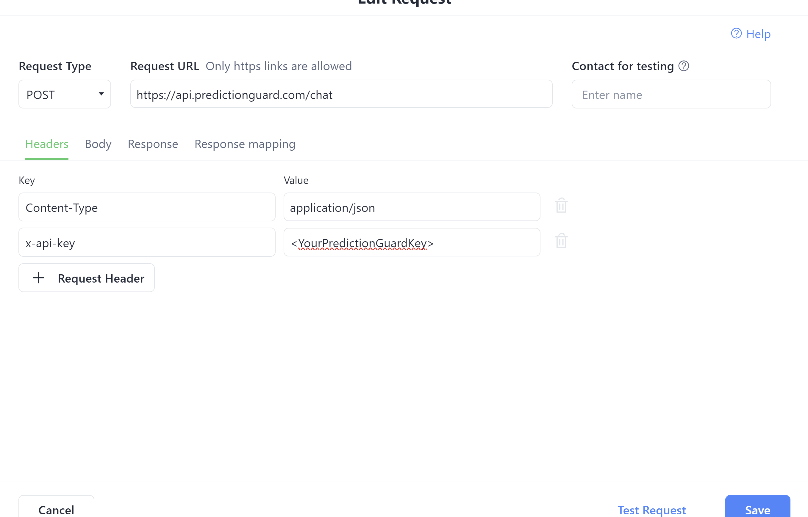

# ManyChat Example: Implementing LLM Responses with Prediction Guard API

## Overview
ManyChat, a popular chat automation tool, is used extensively for customer service. This guide covers two methods to integrate LLM responses using the Prediction Guard API. The first method is straightforward, involving a single question without context, and can be set up quickly without manual coding. The second method is more complex, requiring a lambda function (or similar) to process chat requests, interact with Prediction Guard, and respond via ManyChat's [dynamic block](https://manychat.github.io/dynamic_block_docs/channels/). While it's possible to manage context solely within ManyChat, it requires significant manual effort and you will possibly lose context after a certain amount of responses.


### No Context Example
Our goal in this example is to allow the customer to click a button if they need a question answered. This will send a request to the Prediction Guard Chat API endpoint and the response from the API will be sent to the customer as a Telegram message. They can then choose to ask a new question, speak to an agent, or close the conversation.

#### Prerequisites
- Prediction Guard API Key
- [Sign up for ManyChat](https://manychat.com/signup) (Premium account required)
- [Create two ManyChat User Custom fields](https://support.manychat.com/support/solutions/articles/36000003046-user-input-and-custom-fields) (User_Question1, Bot_Response1)
- [Create a Telegram bot](https://support.manychat.com/support/solutions/articles/36000329373-getting-started-how-to-create-a-telegram-bot-in-manychat)

#### Steps
1. **Create a New Automation:** Begin by setting up a new automation.
2. **Trigger Automation:** Select an appropriate context to trigger the automation.
3. **Create a Telegram Menu:** Use a telegram send message block to build a menu. Include a “Question?” button to send user queries to Prediction Guard.
4. **User Input Block:** Add a block for users to input their questions.


5. **Prompt and Save Response:** Prompt users to enter their question and save the response to a custom field (e.g., User_Question1).
6. **External Request Action Block:** Set up this block for making HTTP Post requests to [https://api.predictionguard.com/chat](https://api.predictionguard.com/chat) with necessary headers and body.

The body should look something like this (make sure to add the user question field to the request):
```json
{
    "model": "Neural-Chat-7B",
    "messages": [
        {
            "role": "system",
            "content": "You are a helpful bot for a company called prediction guard."
        },
        {
            "role": "user",
            "content": "<YOUR USER QUESTION PLACEHOLDER>"
        }
    ]
}
```



7. **Clear User Field for Bot_Response1:** This should be above the External Request Action.
8. **Test the Response:** Ensure that the system works as intended.
9. **Map Response to Custom Field:** Link the API response to the Bot_Response1 custom field. (The JSON path should be something like this : $.choices[0].message.content)
10. **Create Response Message Block:** Set up a block in ManyChat to relay the response to the user (this should output the Bot_Response1 field).
11. **Provide Additional Options:** Include options for users to ask new questions (this would route back to the external request block), speak to an agent, or close the conversation.

After completing this example your flow should look like this:


### Include Conversation Context Example
Our goal in this example is to allow the customer to click a button if they need a question answered. However, notably this will include the context of the previous questions. This will send a request to your personal Lambda function url that processes the ManyChat input, makes an API request to PredictionGuard, and formats the response for ManyChat. The ManyChat response will send the message to the customer and also replace/create the text in your context fields in manychat you will create. They can then choose to continue that conversation, ask a new question (which will clear the context fields), speak to an agent, or close the conversation.

#### Prerequisites
- Your Prediction Guard API Key
- [Sign-up for Manychat](https://manychat.com/signup) (must be a premium account)
- [Create two Manychat User Custom fields](https://support.manychat.com/support/solutions/articles/36000003046-user-input-and-custom-fields#:~:text=Custom%20Fields%20allow%20you%20to,to%20create%20and%20manage%20them.) (User_Text, Bot_Text)
- [Create a telegram bot](https://support.manychat.com/support/solutions/articles/36000329373-getting-started-how-to-create-a-telegram-bot-in-manychat)
- [AWS Lambda Function that can be reached by the Internet](https://docs.aws.amazon.com/lambda/)

#### Steps
1. **Follow Basic Example Steps:** Implement steps 1-6 from the no context example.
2. **Use Dynamic Content:** Instead of making an External Request Action Block we are actually going to add a “Get Dynamic Content” block:


3. **Send Data to Lambda Function:** Configure the block to send "Full Contact Data" to your [Lambda function URL](https://docs.aws.amazon.com/lambda/latest/dg/lambda-urls.html):


4. **Lambda Function Goals:**
- Parse Incoming Request.
- Extract Custom Fields.
- Extract Conversation History which we will save to the User_Text, Bot_Text custom **TEXT** customer fields [you should have made](https://support.manychat.com/support/solutions/articles/36000003046-user-input-and-custom-fields). We will not be using an array type due to current limitations at the time of creating this article. However, these should be stored in an array type format so you can programmatically build the [Prediction Guard API chat request](https://docs.predictionguard.com/reference/chat).
- Append the last customer input to the user messages array (User_Text)
- Prepare Messages for API Request by formatting a request in the format required by the [Prediction Guard API](https://docs.predictionguard.com/reference/chat)
- Make API Request to Prediction Guard and Process Response
- Append the Prediction Guard chat response to the bot messages array (Bot_Text)
- Format ManyChat Response (it must be formatted as noted in this [doc](https://manychat.github.io/dynamic_block_docs/channels/), please make sure to note what platform you are using) This will respond to the user and also save over the new User_Text, Bot_Text with the new complete context.

#### JavaScript Example for Lambda Function
```javascript
 const https = require('https');
    
    exports.handler = async (event) => {
        // Parse the incoming ManyChat request
        const requestBody = JSON.parse(event.body);
        const customFields = requestBody.custom_fields;
    
        // Extract the latest user question and conversation history
        const lastUserInput = customFields.convo_placeholder;
        const userArrayString = customFields.User_Text || JSON.stringify([]);
        const botArrayString = customFields.Bot_Text || JSON.stringify([]);
    
        const userArray = JSON.parse(userArrayString);
        const botArray = JSON.parse(botArrayString);
    
        // Append the latest user input to the user array
        userArray.push(lastUserInput);
    
        // Prepare the messages array for the PredictionGuard API request
        let messages = [
            {
                role: "system",
                content: "You are a helpful assistant for a toy Company named Walt's Toys. Welcome the customer and only talk about toys!"
            },
            // Interleave user and bot messages
            ...userArray.map((content, i) => [{ role: "user", content }, { role: "assistant", content: botArray[i] }])
                       .flat()
                       .filter(msg => msg.content) // Filter out undefined content
        ];
    
        const apiData = JSON.stringify({ model: "Neural-Chat-7B", messages });
    
        const options = {
            hostname: 'api.predictionguard.com',
            path: '/chat',
            method: 'POST',
            headers: {
                'Content-Type': 'application/json',
                'x-api-key': '<YOUR PREDICTION GUARD API KEY>' // Replace with your actual API key
            }
        };
    
        // Function to make the API request
        const makeApiRequest = () => {
            return new Promise((resolve, reject) => {
                const req = https.request(options, (res) => {
                    let responseString = '';
    
                    res.on('data', (chunk) => {
                        responseString += chunk;
                    });
    
                    res.on('end', () => {
                        try {
                            const response = JSON.parse(responseString);
                            if (!response.choices || response.choices.length === 0) {
                                throw new Error('Invalid response: choices array is missing or empty.');
                            }
                            resolve(response);
                        } catch (error) {
                            reject(error);
                        }
                    });
                });
    
                req.on('error', (error) => {
                    reject(error);
                });
    
                req.write(apiData);
                req.end();
            });
        };
    
        try {
            const apiResponse = await makeApiRequest();
            const replyMessage = apiResponse.choices[0].message.content;
    
            // Append the API response to the bot array
            botArray.push(replyMessage);
    
            // Format the response for ManyChat
            const manyChatResponse = {
                version: "v2",
                content: {
                    type: "telegram", // Adjust as needed
                    messages: [{
                        type: "text",
                        text: replyMessage
                    }],
                    actions: [
                        {
                            action: "set_field_value",
                            field_name: "User_Text",
                            value: JSON.stringify(userArray)
                        },
                        {
                            action: "set_field_value",
                            field_name: "Bot_Text",
                            value: JSON.stringify(botArray)
                        }
                    ],
                    quick_replies: [] // Adjust as needed
                }
            };
    
            return {
                statusCode: 200,
                body: JSON.stringify(manyChatResponse),
                headers: { 'Content-Type': 'application/json' }
            };
        } catch (error) {
            return {
                statusCode: 500,
                body: JSON.stringify({ message: error.message }),
                headers: { 'Content-Type': 'application/json' }
            };
        }
    };
```

#### Response Format for ManyChat (Telegram)
Your response to ManyChat for Telegram should look something like [this](https://manychat.github.io/dynamic_block_docs/channels/):

```json
{
    "version": "v2",
    "content": {
        "type": "telegram",
        "messages": [
            {
                "type": "text",
                "text": "I'm still doing great, and I'm ready to help you find the perfect toy for your little one. Let me know if you need any recommendations or have any questions. We have a lot of fun toys to explore together!"
            }
        ],
        "actions": [
            {
                "action": "set_field_value",
                "field_name": "User_Text",
                "value": "[\"How is your day?\",\"How is your day?\"]"
            },
            {
                "action": "set_field_value",
                "field_name": "Bot_Text",
                "value": "[\"Hello there! I'm doing great, as I'm always excited to talk about toys. How about you? Are you looking for any specific toys or just browsing? We have a wide variety of options for you to choose from.\",\"I'm still doing great, and I'm ready to help you find the perfect toy for your little one. Let me know if you need any recommendations or have any questions. We have a lot of fun toys to explore together!\"]"
            }
        ],
        "quick_replies": []
    }
}
```
5. **Configure the rest of the flow**

   - The customer should be able to continue the conversation. This should just route back to the dynamic request without clearing the user fields.
   - The customer should also be able to ask a new question, which should clear the user fields. This action clears the context of the conversation.
   - Finally, it is best to provide a way for a person to reach a real human agent and close the ticket if they so desire.

After completing this your flow should look like this: 


If you followed this example your Telegram bot should be able to respond with the context of the entire conversation:


Happy chatting!


