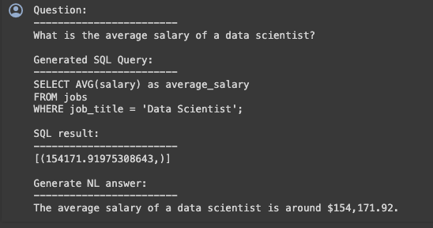
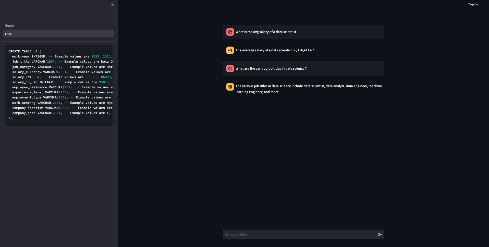

# Using LLMs for Data Analysis and SQL Query Generation

(Run this example in Google Colab [here](https://colab.research.google.com/drive/15nOCaau9tXpov3MHg3fnuWWyfavxdaSA?usp=sharing))

Large language models (LLMs) like 'deepseek-coder-6.7B-instruct' have demonstrated impressive capabilities for understanding natural language and generating SQL. We can leverage these skills for data analysis by having them automatically generate SQL queries against known database structures. And then rephrase these sql outputs using state of the art text/chat completion models like 'Neural-Chat-7B' to get well written answers to user questions.

Unlike code generation interfaces that attempt to produce executable code from scratch, our approach focuses strictly on generating industry-standard SQL from plain English questions. This provides two major benefits:

- SQL is a well-established language supported across environments, avoiding the need to execute less secure auto-generated code. 

- Mapping natural language questions to SQL over known schemas is more robust than attempting to generate arbitrary code for unfamiliar data structures.  

By combining language model understanding of questions with a defined database schema, the system can translate simple natural language queries into precise SQL for fast and reliable data analysis. This makes surfacing insights more accessible compared to manual SQL writing or hopelessly broad code generation.

For this demo we have selecteed a public dataset from Kaggle - Jobs and Salaries in Data Science (Find the dataset [here](https://www.kaggle.com/datasets/hummaamqaasim/jobs-in-data?resource=download))


# Streamlit Chat Application for Data Analysis

This document explains a Streamlit application designed to simulate a chat interface for querying and analyzing Shopify data using various Python libraries such as pandas, LanceDB, LangChain, PredictionGuard, and others.

## Setup

First, import the necessary libraries:

```python
import time
import os
import pandas as pd
import streamlit as st
import lancedb
from lancedb.embeddings import with_embeddings
from langchain import PromptTemplate
import predictionguard as pg
import requests
import duckdb
import re
import json
```

## Lance DB Setup
Connect to a LanceDB database for caching responses to improve performance:

```python
uri = "demo.lancedb"
db = lancedb.connect(uri)
```

Define functions for embedding queries and caching:

```python
def embed(query, embModel):
    return embModel.encode(query)

def batch_embed_func(batch):
    return [st.session_state['en_emb'].encode(sentence) for sentence in batch]
```
## Authentication
Implement a simple password check to restrict access to the app:

```python
def check_password():
    """Returns `True` if the user had the correct password."""

    def password_entered():
        """Checks whether a password entered by the user is correct."""
        if st.session_state["password"] == st.secrets["password"]:
            st.session_state["password_correct"] = True
            del st.session_state["password"]  # don't store password
        else:
            st.session_state["password_correct"] = False

    if "password_correct" not in st.session_state:
        # First run, show input for password.
        st.text_input(
            "Password", type="password", on_change=password_entered, key="password"
        )
        return False
    elif not st.session_state["password_correct"]:
        # Password not correct, show input + error.
        st.text_input(
            "Password", type="password", on_change=password_entered, key="password"
        )
        st.error("😕 Password incorrect")
        return False
    else:
        # Password correct.
        return True
```

## Streamlit Configuration
Hide the Streamlit hamburger menu and footer for a cleaner UI:

```python
hide_streamlit_style = """
<style>
#MainMenu {visibility: hidden;}
footer {visibility: hidden;}
</style>
"""
st.markdown(hide_streamlit_style, unsafe_allow_html=True)
```

## Data Loading
Load data into a pandas DataFrame and register it with duckDB for SQL querying. Store data information for passing in to further prompts:

```python
@st.cache_resource
def load_data():
    # Load data from CSV
    return pd.read_csv('path_to_data.csv')

df = load_data()
```

## Connect to the Database
```python
# Here we will use DuckDB (an in process database) as a SQL database
# interface to our data. In real world use cases, you could still use DuckDB
# to connect to your database, or you could connect via another client.

# Create an in memory database with DuckDB
# see: https://duckdb.org/docs/api/python/dbapi.html
conn = duckdb.connect(database=':memory:')

# make our data frame available as a view in duckdb
conn.register('jobs', df)
```

## Define the Schema

```python
@st.cache_resource
def create_schema(df):
    # Here we will create an example SQL schema based on the data in this dataset.
    # In a real use case, you likely already have this sort of CREATE TABLE statement.
    # Performance can be improved by manually curating the descriptions.

    columns_info = []

    # Iterate through each column in the DataFrame
    for col in df.columns:
        # Determine the SQL data type based on the first non-null value in the column
        first_non_null = df[col].dropna().iloc[0]
        if isinstance(first_non_null, np.int64):
            kind = "INTEGER"
        elif isinstance(first_non_null, np.float64):
            kind = "DECIMAL(10,2)"
        elif isinstance(first_non_null, str):
            kind = "VARCHAR(255)"  # Assuming a default max length of 255
        else:
            kind = "VARCHAR(255)"  # Default to VARCHAR for other types or customize as needed

        # Sample a few example values
        example_values = ', '.join([str(x) for x in df[col].dropna().unique()[0:4]])

        # Append column info to the list
        columns_info.append(f"{col} {kind}, -- Example values are {example_values}")

    # Construct the CREATE TABLE statement
    create_table_statement = "CREATE TABLE df (\n  " + ",\n  ".join(columns_info) + "\n);"

    # Adjust the statement to handle the final comma, primary keys, or other specifics
    create_table_statement = create_table_statement.replace(",\n);", "\n);")

    return create_table_statement

schema=create_schema(df)
```

```python
CREATE TABLE df (
  work_year INTEGER, -- Example values are 2023, 2022, 2020, 2021,
  job_title VARCHAR(255), -- Example values are Data DevOps Engineer, Data Architect, Data Scientist, Machine Learning Researcher,
  job_category VARCHAR(255), -- Example values are Data Engineering, Data Architecture and Modeling, Data Science and Research, Machine Learning and AI,
  salary_currency VARCHAR(255), -- Example values are EUR, USD, GBP, CAD,
  salary INTEGER, -- Example values are 88000, 186000, 81800, 212000,
  salary_in_usd INTEGER, -- Example values are 95012, 186000, 81800, 212000,
  employee_residence VARCHAR(255), -- Example values are Germany, United States, United Kingdom, Canada,
  experience_level VARCHAR(255), -- Example values are Mid-level, Senior, Executive, Entry-level,
  employment_type VARCHAR(255), -- Example values are Full-time, Part-time, Contract, Freelance,
  work_setting VARCHAR(255), -- Example values are Hybrid, In-person, Remote,
  company_location VARCHAR(255), -- Example values are Germany, United States, United Kingdom, Canada,
  company_size VARCHAR(255), -- Example values are L, M, S
);
```
## Prompt Templates
Define prompt templates for generating SQL queries and chatbot responses using LangChain:

```python
thread_template = """### User:
{user}

### Assistant:
{assistant}"""

thread_prompt = PromptTemplate(template=thread_template,
    input_variables=["user", "assistant"],
)

qa_template = """### System:
You are a data chatbot who answers the user question. To answer these questions we need to run SQL queries on our data and its output is given below in context. You just have to frame your answer using that context and message history. Give a short and crisp response.Don't add any notes or any extra information after your response.

{thread}

### User:
Question: {question}

context: {context}

### Assistant:
"""

qa_prompt = PromptTemplate(template=qa_template,input_variables=["thread", "question", "context"])

sql_template = """<|begin_of_sentence|>You are a SQL expert and you only generate SQL queries which are executable. You provide no extra explanations.
You respond with a SQL query that answers the user question in the below instruction by querying a database with the schema provided in the below instruction.
Always start your query with SELECT statement and end with a semicolon.

### Instruction:
User question: \"{question}\"

Database schema:
{schema}

### Response:
"""
sql_prompt=PromptTemplate(template=sql_template, input_variables=["question","schema"])
```

## Cache Functions
Implement functions to check the cache for existing responses and add new responses to the cache:

```python
def check_cache(new_input):
    if "chat" in db.table_names():
        table = db.open_table("chat")
        results = table.search(embed(new_input, st.session_state['en_emb'])).limit(1).to_pandas()
        results = results[results['_distance'] < 0.2]
        if len(results) == 0:
            return False, {}
        else:
            results.sort_values(by=['_distance'], inplace=True, ascending=True)
            return True, results['answer'].values[0]
    else:
        return False, {}
        
def add_to_cache(new_input, answer):
    pre_process_data = []
    pre_process_data.append([
        new_input,
        answer
    ])
    ppdf = pd.DataFrame(pre_process_data, columns=[
        'text', 
        'answer'
    ])
    vecData = with_embeddings(batch_embed_func, ppdf)
    if "chat" not in db.table_names():
        db.create_table("chat", data=vecData)
    else:
        table = db.open_table("chat")
        table.add(data=vecData)
```

## Generating SQL Queries
Generate SQL queries based on user questions using PredictionGuard and process the queries:

```python
columns=dataset.columns
def generate_sql_query(question):
    prompt_filled = sql_prompt.format(question=question, schema=create_table_statement)

    try:
        result = pg.Completion.create(
            model="deepseek-coder-6.7b-instruct",
            prompt=prompt_filled,
            max_tokens=300,
            temperature=0.1
        )
        sql_query = result["choices"][0]["text"]
        return sql_query
    except Exception as e:
        print(f"Error generating SQL query: {e}")
        return None

def extract_and_refine_sql_query(sql_query):
    # Extract SQL query using a regular expression
    match = re.search(r"(SELECT.*?);", sql_query, re.DOTALL)
    if match:
        refined_query = match.group(1)
        # Check for and remove any text after a colon
        colon_index = refined_query.find(':')
        if colon_index != -1:
            refined_query = refined_query[:colon_index]
        # Ensure the query ends with a semicolon
        if not refined_query.endswith(';'):
            refined_query += ';'
        return refined_query
    else:
        return ""
def get_answer_from_sql(question):

    sql_query = generate_sql_query(question)
    print("SQL Query:", sql_query)

    sql_query = extract_and_refine_sql_query(sql_query)
    print("Refined SQL Query:", sql_query)

    try:
        print("Executing SQL Query:", sql_query)
        result = conn.execute(sql_query).fetchall()
        print("Result:", result)
        return result
    except Exception as e:  # Catching a broader range of exceptions
        print(f"Error executing SQL query: {e}")
        return "There was an error executing the SQL query."
```

## Generating Responses
Generate responses to user questions based on SQL query results:

```python
def get_answer(question, thread,context):  
        try:

            prompt_filled = qa_prompt.format(thread=thread, question=question, context=context)

            # Respond to the user
            output = pg.Completion.create(
                model="Neural-Chat-7B",
                prompt=prompt_filled,
                max_tokens=100,
                temperature=0.1
            )
            completion = output['choices'][0]['text']

            return completion
        except Exception as e:
            completion = "There was an error executing the SQL query."
            return completion
```

## Streamlit Chat Interface
Implement the chat interface, handling user input and displaying responses:

```python
if st.session_state['login'] == False:
    if not check_password():
        st.stop()

if "messages" not in st.session_state:
    st.session_state.messages = []

for message in st.session_state.messages:
    with st.chat_message(message["role"]):
        st.markdown(message["content"])

if prompt := st.chat_input("Ask a question"):
    st.session_state.messages.append({"role": "user", "content": prompt})
    with st.chat_message("user"):
        st.markdown(prompt)

    with st.chat_message("assistant"):
        message_placeholder = st.empty()
        full_response = ""

        # contruct prompt thread
        examples = []
        turn = "user"
        example = {}
        for m in st.session_state.messages:
            latest_message = m["content"]
            example[turn] = m["content"]
            if turn == "user":
                turn = "assistant"
            else:
                turn = "user"
                examples.append(example)
                example = {}
        if len(example) > 2:
            examples = examples[-2:]
        if len(examples) > 0:
            thread = "\n\n".join([thread_prompt.format(
                user=e["user"],
                assistant=e["assistant"]
            ) for e in examples])
        else:
            thread = ""

        # Check for PII
        with st.spinner("Checking for PII..."):
            pii_result = pg.PII.check(
                prompt=latest_message,
                replace=False,
                replace_method="fake"
            )

        # Check for injection
        with st.spinner("Checking for security vulnerabilities..."):
            injection_result = pg.Injection.check(
                prompt=latest_message,
                detect=True
            )

        # Check the cache
        incache, cached_response = check_cache(latest_message)
        if incache:
            with st.spinner("Generating an answer..."):
                time.sleep(1)
                completion = cached_response

            # display response
            for token in completion.split(" "):
                full_response += " " + token
                message_placeholder.markdown(full_response + "▌")
                time.sleep(0.075)
            message_placeholder.markdown(full_response)

        # Handle insecure states
        elif "[" in pii_result['checks'][0]['pii_types_and_positions']:
            st.warning('Warning! PII detected. Please avoid using personal information.')
            full_response = "Warning! PII detected. Please avoid using personal information."
        elif injection_result['checks'][0]['probability'] > 0.5:
            st.warning('Warning! Injection detected. Your input might result in a security breach.')
            full_response = "Warning! Injection detected. Your input might result in a security breach."

        # generate response
        else:
            with st.spinner("Generating an answer..."):
                context=get_answer_from_sql(latest_message)
                print("context",context)
                completion = get_answer(latest_message, thread,context)

                # display response
                for token in completion.split(" "):
                    full_response += " " + token
                    message_placeholder.markdown(full_response + "▌")
                    time.sleep(0.075)
                message_placeholder.markdown(full_response)

        if not incache:
            add_to_cache(latest_message, full_response)

    st.session_state.messages.append({"role": "assistant", "content": full_response})

```



## For Multiple Tables
In this case we will be using a RAG based approach which will involve semantic comparison of user questions with the tables we have in our database. Once we have shortlisted the most relavent table having the data , we then process that table with the similar process as above to generate the answer.

You can go through this code to replicate for your various use cases :
(Run this example in Google Colab [here](https://colab.research.google.com/drive/1zj9sic1H-tAw3BRvPGZAwGdMg4l5Y2FU?usp=sharing))

## Conclusion



This document outlines the structure of a Streamlit application designed for interactive data analysis through a chat interface. It leverages several advanced Python libraries and techniques, including caching responses with LanceDB, executing SQL queries on pandas dataframes, and generating dynamic responses using LangChain and PredictionGuard.

