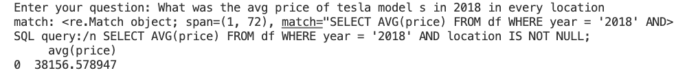

# Using LLMs for Data Analysis and Query Generation

Large language models (LLMs) like Nous-Hermer-Llama2, WizardCoder have shown impressive capabilities for understanding and generating natural language. We can leverage these skills for data analysis tasks like extracting insights from tables, automatically generating SQL queries, and more. 

PredictionGuard provides access to such state-of-the-art models that maintain strong capabilities while including safety measures to mitigate potential harms. We'll walk through an example of using this LLM for data analysis on sample Tesla data from Kaggle.
[Link to dataset](./https://www.kaggle.com/datasets/aravindrajpalepu/tesla-used-cars)

## Understanding Table Data

First we load a sample Tesla dataset with Pandas:

```python
import pandas as pd

df = pd.read_csv("tesla-data.csv") 
```
We can format this table data and provide an analytical question for the LLM to answer:
## Query Generation with LLMs  
We'll use the LangChain library to simplify prompting our LLM. Define a prompt template that asks to generate a SQL query answering our question based on the table data:

```python
from langchain import PromptTemplate

template = """Instruction: Generate a full SQL query that answers the question "{question}" using the below input "df" table. Always start your query with a SELECT statement and end with a semicolon.

Input:
{table}

Response:
"""
prompt = PromptTemplate(
    template=template, 
    input_variables=["question", "table"],
)
```

We provide just a small sample of rows from our full dataset. Sampling real rows gives an exemplar template of our structure, allowing higher quality query generation adapted to our dataset.

Additionally, only showing a subset of rows keeps our input well within the context size LLMs can effectively process. 

```python
table=df.head(2)
```

We can specify the desired models and modify parameters based on the complexity of the queries needed.
Higher token limits allow generating longer, more complex queries. Adjusting the temperature modifies the randomness - lower values produce more focused SQL with fewer extraneous elements.

Now we can get an auto-generated SQL query result targeting our question and data:

```python
question = input("Enter your question: )"
result = pg.Completion.create(
    model="Nous-Hermes-Llama2-13B",
    prompt=prompt.format(
        question=question, 
        table=df.head(2)
    ) ,
    max_tokens=200,
    temperature=0.1
)
full_text = result["choices"][0]["text"]
```
## DuckDB Capabilities

For this example we use [DuckDB](https://duckdb.org/) to execute the SQL queries produced by the LLM on our Pandas dataframe data. 

DuckDB provides an embedded SQL database with support for rapid analytics directly on data loaded from Pandas, Parquet, CSVs, and more. Some key capabilities:

**SQL Interface**

DuckDB allows executing standard ANSI SQL queries on the loaded data. We can leverage LLMs to auto-generate optimized SQL analyzing our datasets.

**Dataframe Integration** 

Results from SQL queries on DuckDB can be directly loaded into Pandas dataframes for further analysis and visualization.

## Extracting and Executing the Query
We extract out the full SQL query from the generated result and execute it with DuckDB to display the query result:

```python
# Extract SQL query using a regular expression
match = re.search(r"(SELECT.*?;)", full_text, re.DOTALL) 
print("match: " + str(match))
if match:
    query = match.group(1)
else:
    query = ""
if not query.endswith(';'):
    query += ';'
print("SQL query:/n " + query)  

# Connect to DuckDB and execute the query
conn = duckdb.connect()
cursor = conn.cursor()

try:
    cursor.execute(query)
    result_df = cursor.fetchdf()  
    print(result_df)
except duckdb.Error as e:
    print(f"Error executing query: {e}")

conn.close()
```
# A demo of our PG query generator in action

The steps could be adapted to any dataset and expanded with visualization of result data frames using libraries like Matplotlib.