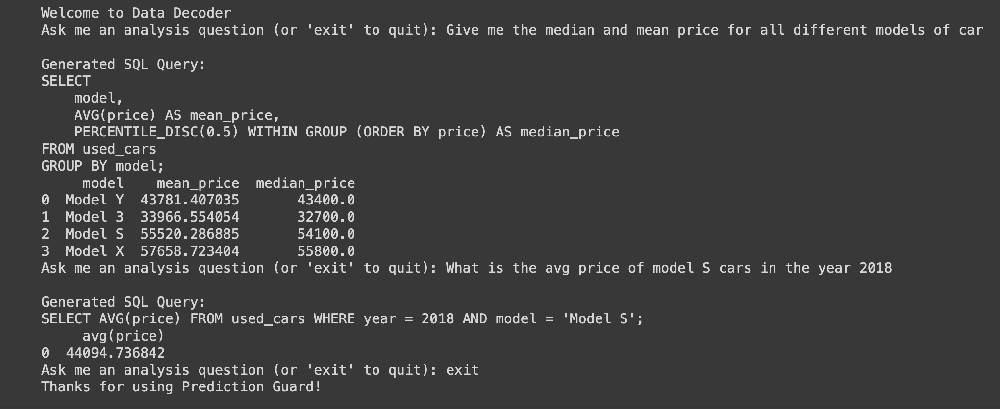

# Using LLMs for Data Analysis and SQL Query Generation

(Run this example in Google Colab [here](https://colab.research.google.com/drive/1zx1wlKFDYDUCXuHPmSR0yn61HjvaclfE#scrollTo=ZLEq99jt0Wvj))

Large language models (LLMs) like Nous-Hermes-Llama2-13B and WizardCoder have demonstrated impressive capabilities for understanding natural language and generating SQL. We can leverage these skills for data analysis by having them automatically generate SQL queries against known database structures.

Unlike code generation interfaces that attempt to produce executable code from scratch, our approach focuses strictly on generating industry-standard SQL from plain English questions. This provides two major benefits:

- SQL is a well-established language supported across environments, avoiding the need to execute less secure auto-generated code. 

- Mapping natural language questions to SQL over known schemas is more robust than attempting to generate arbitrary code for unfamiliar data structures.  

By combining language model understanding of questions with a defined database schema, the system can translate simple natural language queries into precise SQL for fast and reliable data analysis. This makes surfacing insights more accessible compared to manual SQL writing or hopelessly broad code generation.

Prediction Guard provides access to such state-of-the-art models that maintain strong capabilities while including safety measures to mitigate potential harms. We'll walk through an example of using these LLMs for data analysis on sample Tesla data from Kaggle.  
[Link to dataset](https://www.kaggle.com/datasets/aravindrajpalepu/tesla-used-cars)

## Understanding Table Data
This dataset contains information on various used Tesla cars available for purchase on the Tesla website in the United States. The data was collected through web scraping and provides detailed specifications and prices for different Tesla models.

A closer look at the data :

|index|model|year|odometer|price|location|driveTrain|DAS|accident\_history|paintJob|wheels|emi|zipCode|interior|state|
|---|---|---|---|---|---|---|---|---|---|---|---|---|---|---|
|0|Model S|2018\.0|36438\.0|53300\.0|Colma, CA|100D Long Range All-Wheel Drive|Autopilot|Previously Repaired|Red Multi-Coat Paint|19" Silver Slipstream Wheels|$824 /mo|85209|Cream Premium Interior|CA|
|1|Model S|2018\.0|30180\.0|59200\.0|Colma, CA|100D Long Range All-Wheel Drive|Previously Repaired|30-Day Premium Connectivity Trial|Midnight Silver Metallic Paint|21" Sonic Carbon Twin Turbine Wheels|$930 /mo|85209|Black Premium Interior|CA|
|2|Model S|2018\.0|95696\.0|36100\.0|Scottsdale, AZ|100D Long Range All-Wheel Drive|Enhanced Autopilot|No Reported Accidents/Damage|Midnight Silver Metallic Paint|19" Sonic Carbon Slipstream Wheels|$514 /mo|85209|Black Premium Interior|AZ|
|3|Model S|2018\.0|36438\.0|53300\.0|Colma, CA|100D Long Range All-Wheel Drive|Autopilot|Previously Repaired|Red Multi-Coat Paint|19" Silver Slipstream Wheels|$824 /mo|85251|Cream Premium Interior|CA|
|4|Model S|2018\.0|30180\.0|59200\.0|Colma, CA|100D Long Range All-Wheel Drive|Previously Repaired|30-Day Premium Connectivity Trial|Midnight Silver Metallic Paint|21" Sonic Carbon Twin Turbine Wheels|$930 /mo|85251|Black Premium Interior|CA|

We load this sample Tesla used cars dataset with Pandas:

```python copy
import pandas as pd

used_cars = pd.read_csv("tesla-data.csv") 
```

Next, we will define a semantically meaningful data dictionary which describes table names, column names, and corresponding data counts.

```python copy
table_info={
    "table_name":"used_cars",
    "columns":
      {'model': 'Car model',
      'year': 'Manufacturing year of the car',
      'odometer': 'Mileage of the car in miles',
      'price': 'Price of the car in dollars',
      'location': 'Location where the car is located',
      'driveTrain': 'Type of drive train (e.g., All-Wheel Drive)',
      'DAS': 'Driver Assistance System details',
      'accident_history': 'History of accidents (e.g., Previously Repaired)',
      'paintJob': 'Color and type of paint job',
      'wheels': 'Type and size of the car wheels',
      },
    "snapshot": used_cars.value_counts()
}
```

## Query Generation with LLMs

We'll use the LangChain library to simplify prompting our LLM. Specifically, we will define a prompt template that instructs the LLM to generate a SQL query answering our question based on the table schema:

```python copy
from langchain import PromptTemplate

template = """### Instruction: 

You can generate a full SQL query that answers the question using the schema information about available database tables. Always start your query with a SELECT statement and end with a semicolon.

{table_info}

### Input:
{question}

### Response:
"""
prompt = PromptTemplate(
    template=template, 
    input_variables=["question", "table_info"],
)
```

The function "generate_and_process_query" makes use of the "Nous-Hermes-Llama2-13B" language model. It constructs a prompt string by formatting the input question and a DataFrame's value counts into the prompt. The model generates a completion for the prompt, and the resulting text is processed to extract an SQL query using a regular expression. The extracted query is then returned. 

We could also utilize models like "WizardCoder" to get similar outputs.

```python copy
def generate_and_preprocess_query(question):
  result = pg.Completion.create(
      model="Nous-Hermes-Llama2-13B",
      prompt=prompt.format(
          question=question,
          table_info=table_info
      ),
      max_tokens=1000,
      temperature=0.1
  )

  full_text = result["choices"][0]["text"]

  # Extract SQL query using a regular expression
  match = re.search(r"(SELECT.*?;)", full_text, re.DOTALL)
  if match:
      query = match.group(1)
  else:
      query = ""
  if not query.endswith(';'):
      query += ';'
  return query
```

## Using DuckDB with LLMs

For this example we use [DuckDB](https://duckdb.org/) to execute the SQL queries produced by the LLM on our Pandas dataframe data. DuckDB could also be used to execute similar queries against live databases or other types of data. DuckDB allows executing standard ANSI SQL queries on a variety of types of data, whether from CSVs or enterprise SQL databases. We can leverage LLMs to auto-generate optimized SQL for analyzing datasets from an organization's existing database infrastructure.

For demonstration purposes, we load reference data into a DuckDB instance as a proxy for a real production database. However, in a live enterprise environment, DuckDB would integrate directly with systems like Postgres, Redshift, or Snowflake to enable natural language queries across the company's data.

The underlying architecture supports both standalone CSV analysis as well as live connected databases through DuckDB. By generating ANSI SQL queries, the system can surface insights over existing data warehouses without disruption. This makes adopting natural language conversational analytics seamless for any organization.

## Query Execution

The below code provides an interactive command line interface that allows users to ask analytical questions in plain English. It then handles the complexity of converting those natural language questions into structured SQL queries that can extract insights from data.

When a user provides a question through text input, the key mechanism that drives the conversion to SQL is the generate_and_preprocess_query() function. This handles the natural language processing required to analyze the question and construct an appropriate database query.

The resulting SQL query is printed back to the user before also being executed automatically through integration with the DuckDB database. DuckDB allows running SQL queries in a simple and lightweight manner within the Python environment.

Finally, the full results of the query are formatted as a Pandas DataFrame and printed to display the retrieved data insights back to the user.

```python copy
import duckdb

print("Welcome to Data Analysis Assistant")

def execute_sql(query):
  df = duckdb.sql(query).df()  
  return df

while True:
    question = input("Ask me an analysis question (or 'exit' to quit): ")
    
    if question.lower() == 'exit':
        break
        
    query = generate_and_preprocess_query(question)
    print("\nGenerated SQL Query:")
    print(query)
    
    try:
        print(execute_sql(query))
    except:
        print("Sorry, I couldn't execute that query.")
        
    print("\n---\n")

print("Thanks for using Prediction Guard!")
```


These steps could be adapted to any dataset and expanded with visualization of result data frames using libraries like `matplotlib`.

