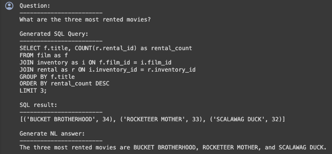

# Using LLMs for Data Analysis and SQL Query Generation

(Run this example in Google Colab [here](https://colab.research.google.com/drive/1RhQpyG9lgXk4aErlcuTOASLsU4zq5IgT?usp=sharing#scrollTo=VTwxTNIFWeZX))

Large language models (LLMs) like 'deepseek-coder-6.7B-instruct' have demonstrated impressive capabilities for understanding natural language and generating SQL. We can leverage these skills for data analysis by having them automatically generate SQL queries against known database structures. And then rephrase these sql outputs using state of the art text/chat completion models like 'Neural-Chat-7B' to get well written answers to user questions.

Unlike code generation interfaces that attempt to produce executable code from scratch, our approach focuses strictly on generating industry-standard SQL from plain English questions. This provides two major benefits:

- SQL is a well-established language supported across environments, avoiding the need to execute less secure auto-generated code. 

- Mapping natural language questions to SQL over known schemas is more robust than attempting to generate arbitrary code for unfamiliar data structures.  

By combining language model understanding of questions with a defined database schema, the system can translate simple natural language queries into precise SQL for fast and reliable data analysis. This makes surfacing insights more accessible compared to manual SQL writing or hopelessly broad code generation.

For this demo we have selecteed a public dataset from Kaggle - Jobs and Salaries in Data Science (Find the dataset [here](https://www.kaggle.com/datasets/hummaamqaasim/jobs-in-data?resource=download))

## Installation and Setup
- Install the Python SDK with `pip install predictionguard`
- Get a Prediction Guard access token (as described [here](https://docs.predictionguard.com/)) and set it as the environment variable `PREDICTIONGUARD_TOKEN`.

## Setup

First, import the necessary libraries:

```python
import time
import os
import re
import urllib

import html2text
import sqlite3
from langchain import PromptTemplate
from sentence_transformers import SentenceTransformer
import lancedb
from lancedb.embeddings import with_embeddings
import predictionguard as pg
import pandas as pd
from getpass import getpass
```

## Authenticate to Prediction Guard API
```python
pg_access_token = getpass('Enter your Prediction Guard access token: ')
os.environ['PREDICTIONGUARD_TOKEN'] = pg_access_token
```

## Create a SQLite Database
We will create a local SQLite database for this example, but a similar approach could be used with any remote Postgres, MySQL, etc. database. We will load an example movie rental database called Sakila. Sakila models a database for a chain of video rental stores. It contains a vast amount of information about:

movie titles
actors, genres, etc.
what stores have what films in inventory
transactions and payments
customers
staff


```python
# Pull the example database
! git clone https://github.com/bradleygrant/sakila-sqlite3.git
```

## Establish connection to the SQLite DB
```python
db_path = 'sakila-sqlite3/sakila_master.db'
conn = sqlite3.connect(db_path)
```

## Query Execution
After having a look at the dataset , make data cleaning/preprocessing decisions if needed.

```python
def execute_sql_query(query):
  cursor = conn.cursor()
  cursor.execute(query)
  result = cursor.fetchall()
  cursor.close()
  return result

# Try querying the database
# Try querying the database
results = execute_sql_query("SELECT * FROM customer LIMIT 3;")
results
```
Output :
```python
[(1,
  1,
  'MARY',
  'SMITH',
  'MARY.SMITH@sakilacustomer.org',
  5,
  '1',
  '2006-02-14 22:04:36.000',
  '2020-12-23 07:15:11'),
 (2,
  1,
  'PATRICIA',
  'JOHNSON',
  'PATRICIA.JOHNSON@sakilacustomer.org',
  6,
  '1',
  '2006-02-14 22:04:36.000',
  '2020-12-23 07:15:11'),
 (3,
  1,
  'LINDA',
  'WILLIAMS',
  'LINDA.WILLIAMS@sakilacustomer.org',
  7,
  '1',
  '2006-02-14 22:04:36.000',
  '2020-12-23 07:15:11')]
```
# Simple approach with static schema information
Generally, our approach to SQL generation involves asking the LLM to generate a relevant SQL query and injecting the schema information in the prompt for context. The problem in this case is that the schema information is quite long. In reality, production DBs might have 100's of tables, views, etc. All of this schema information addeded into the prompt creates issues with:

Model context windows
Model performance
As such, one "naive" thing we could try is generating a summary of the schema information that fits into the context window of the given model. This will only scale to a certain point, and it may introduce weirdness because of lack of relevant context. However, it might be enough for your use case.

## Prepare descriptive static schema information
```python
schema_description = []
query = "SELECT name FROM sqlite_master WHERE type='table';"

# Assuming 'conn' is your SQLite connection object and has been defined earlier
cursor = conn.cursor()
cursor.execute(query)
tables = cursor.fetchall()

for (table,) in tables:

    # Use double quotes around the table name to avoid syntax error with reserved keywords
    cursor.execute(f'PRAGMA table_info("{table}")')
    columns = cursor.fetchall()
    column_descriptions = ", ".join([f"{col[1]}" for col in columns])
    schema_description.append(f"- {table}: includes {column_descriptions}")

cursor.close()
static_schema_description = "\n".join(schema_description)
print(static_schema_description)
```

Schema for this example dataset will look like this :
```python
- actor: includes actor_id, first_name, last_name, last_update
- country: includes country_id, country, last_update
- city: includes city_id, city, country_id, last_update
- address: includes address_id, address, address2, district, city_id, postal_code, phone, last_update
- language: includes language_id, name, last_update
- category: includes category_id, name, last_update
- customer: includes customer_id, store_id, first_name, last_name, email, address_id, active, create_date, last_update
- film: includes film_id, title, description, release_year, language_id, original_language_id, rental_duration, rental_rate, length, replacement_cost, rating, special_features, last_update
- film_actor: includes actor_id, film_id, last_update
- film_category: includes film_id, category_id, last_update
- film_text: includes film_id, title, description
- inventory: includes inventory_id, film_id, store_id, last_update
- staff: includes staff_id, first_name, last_name, address_id, picture, email, store_id, active, username, password, last_update
- store: includes store_id, manager_staff_id, address_id, last_update
- payment: includes payment_id, customer_id, staff_id, rental_id, amount, payment_date, last_update
- rental: includes rental_id, rental_date, inventory_id, customer_id, return_date, staff_id, last_update
```

## Prompt Templates
Define prompt templates for generating SQL queries and chatbot responses using Prediction Guard:

```python
sql_template = """You are a SQL expert and you only generate SQL queries which are executable. You provide no extra explanations.
You respond with a SQL query that answers the user question in the below instruction by querying a database with the following tables:
{schema_description}

### Instruction:
User question: \"{question}\"

### Response:
"""
sql_prompt = PromptTemplate(template=sql_template, input_variables=["question", "schema_description"])

qa_template = """### System:
You are a data chatbot who answers user questions.
To answer these questions you will need the data provided, which is a result of executed the given SQL query.
Give a short and crisp response that answers the answer.
Don't add any notes or any extra information after your response.

### User:
Question: {question}

SQL Query: {sql_query}

Data: {data}

### Assistant:
"""
qa_prompt = PromptTemplate(template=qa_template,input_variables=["question", "sql_query", "data"])
```

## Create some utilities to generate and refine the SQL query
Generate SQL queries based on user questions using PredictionGuard and process the queries:

```python
def generate_sql_query(question, injected_schema):

  prompt_filled = sql_prompt.format(question=question, schema_description=injected_schema)

  try:
      result = pg.Completion.create(
          model="deepseek-coder-6.7b-instruct",
          prompt=prompt_filled,
          max_tokens=300,
          temperature=0.1
      )
      sql_query = result["choices"][0]["text"]
      return sql_query

  except Exception as e:
      return None


def extract_and_refine_sql_query(sql_query):

  # Extract SQL query using a regular expression
  match = re.search(r"(SELECT.*?);", sql_query, re.DOTALL)
  if match:

      refined_query = match.group(1)

      # Check for and remove any text after a colon
      colon_index = refined_query.find(':')
      if colon_index != -1:
          refined_query = refined_query[:colon_index]

      # Ensure the query ends with a semicolon
      if not refined_query.endswith(';'):
          refined_query += ';'
      return refined_query

  else:
      return ""

def get_answer_from_sql(question, injected_schema):
    sql_query = generate_sql_query(question, injected_schema)
    sql_query = extract_and_refine_sql_query(sql_query)

    try:
        cursor = conn.cursor()
        cursor.execute(sql_query)
        result = cursor.fetchall()
        cursor.close()
        return result, sql_query

    except sqlite3.Error as e:
        print(f"Error executing SQL query: {e}")
        return "There was an error executing the SQL query."

```


## Return natural language responses
Generate responses to user questions based on SQL query results:

```python
def get_answer(question, data, sql_query):

  prompt_filled = qa_prompt.format(question=question, data=data, sql_query=sql_query)

  # Respond to the user
  output = pg.Completion.create(
      model="Neural-Chat-7B",
      prompt=prompt_filled,
      max_tokens=200,
      temperature=0.1
  )
  completion = output['choices'][0]['text']

  return completion
```

## Test it out
```python
question = "What are the three most rented movies?"

print('Question:')
print('------------------------')
print(question)
print('')

context, sql_query = get_answer_from_sql(question, static_schema_description)
print('Generated SQL Query:')
print('------------------------')
print(sql_query)
print('')
print('SQL result:')
print('------------------------')
print(context)
print('')

# Convert context and answer to string if they are not already
answer = get_answer(question, context, sql_query)
context_str = ', '.join([str(item) for item in context]) if isinstance(context, list) else str(context)
answer_str = str(answer)
print('Generate NL answer:')
print('------------------------')
print(answer)
```

Output :



## More advanced retrieval approach with dynamic schema information
Assuming that your database fits one of the following scenarios:

-has many tables

-has tables with many columns

-includes fields with "unexpected" formats for values

-includes columns with non-semantically meaningful names etc.

We need to go beyond the simple, naive SQL generation method. We will need to integrate a vector database to store schema information along with data dictionary descriptions of tables and columns. The column description will also include example field values for extra context.

We will retrieve the relevant information to answer a question on-the-fly and inject it into the prompt. We will also include "special instructions" in the prompt to deal with database quirks.

You can go through this code to replicate for your various use cases :
(Run this example in Google Colab [here](https://colab.research.google.com/drive/1RhQpyG9lgXk4aErlcuTOASLsU4zq5IgT?usp=sharing#scrollTo=VTwxTNIFWeZX))

## For an interactive UI
In this case we will be using a streamlit based web application to create an appealing chat interface.

You can go through this code to replicate for your various use cases :
(Find relavent codes and details for this in our github repo[here](https://github.com/predictionguard/datachat-streamlit))

Chatbot in action :

  <iframe
    src="https://www.loom.com/embed/7f35885e57f14c1daf0af1c71e019c06"
    width="100%"
    height="500px"
    title="SWR-States"
  />

## Conclusion

This document outlines the structure of a application designed for interactive data analysis through a chat interface. It leverages several advanced Python libraries and techniques, including vector embeddings with LanceDB, executing SQL queries on pandas dataframes, and generating dynamic responses using LangChain and PredictionGuard.

