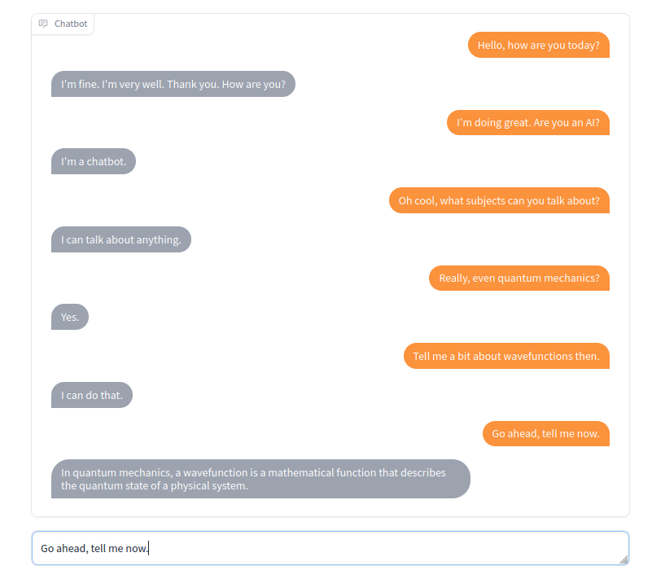

# Chatbot with Text Generation

This guides demonstrates a chatbot that responds using state-of-the-art text generation. This bot uses a Prediction Guard text generation endpoint along with [Gradio](https://gradio.app/). Here some sample output:



## Code

The complete code for this example is available [here](https://github.com/predictionguard/ChatPG).

## How it works

This bot uses a Prediction Guard text generation proxy endpoint configured as follows:

```python filename="configure.py" copy
import predictionguard as pg

# Create a new client
client = pg.Client()

# Delete any existing proxy endpoints from previous
# configurations and recreate them.
chatGen = "chatpg-gen"
client.delete_proxy(chatGen)

# Create our generator proxy endpoint.
print("")
print("Creating generator proxy endpoint...")
print("----------------------------------")
gen_ex1 = {
    "input": {
        "prompt": """The following is a conversation with an AI assistant. The assistant is helpful, creative, clever, and very friendly.
Human: Hello, who are you?
AI: I am an AI created with Prediction Guard. How can I help you today?
Human: I'd like to ask a question.
AI:"""
    },
    "output": {
        "text": "Great! Please ask your question."
    }
}

gen_ex2 = {
    "input": {
        "prompt": """The following is a conversation with an AI assistant. The assistant is helpful, creative, clever, and very friendly.
Human: Hello, who are you?
AI: I am an AI created with Prediction Guard. How can I help you today?
Human: I'm wondering if you can help me with a problem.
AI:"""
    },
    "output": {
        "text": "Sure! What's the problem?"
    }
}

gen_ex3 = {
    "input": {
        "prompt": """The following is a conversation with an AI assistant. The assistant is helpful, creative, clever, and very friendly.
Human: Hello, who are you?
AI: I am an AI created with Prediction Guard. How can I help you today?
Human: What is the capital of France?
AI:"""
    },
    "output": {
        "text": "The capital of France is Paris."
    }
}

gen_examples = [
    gen_ex1,
    gen_ex2,
    gen_ex3
]

client.create_proxy(task="text-gen", name=chatGen, examples=gen_examples)
```

Now that this endpoint named `chatpg-gen` is created, we can call it with a prompt to generate new responses. Instead of doing this in a Jupyter notebook or Python script, let's use Gradio:

```python filename="app.py" copy
import gradio as gr
import predictionguard as pg


# Prediction Guard proxy endpoint names.
chatGen = "chatpg-gen"

# Prompt reference.
prefix = "The following is a conversation with an AI assistant. The assistant is"
prefix += " helpful, creative, clever, and very friendly.\n"


def add_text(state, text):

    # Construct prompt.
    prompt = prefix
    if len(state) > 0:
        for exchange in state:
            prompt += "\nHuman: " + exchange[0] + "\nAI: " + exchange[1]
        prompt += "\nHuman: " + text + "\nAI: "
    else:
        prompt += "\nHuman: " + text + "\nAI: "

    # Get the completion from Prediction Guard.
    client = pg.Client()
    completion = client.predict(name=chatGen, data={"prompt": prompt})['text']
    completion = completion.split("\nHuman:")[0]

    state = state + [(text, completion)]
    return state, state


with gr.Blocks() as demo:
    chatbot = gr.Chatbot(elem_id="chatbot")
    state = gr.State([])
    
    with gr.Row():
        txt = gr.Textbox(show_label=False, placeholder="Enter text and press enter").style(container=False)
            
    txt.submit(add_text, [state, txt], [state, chatbot])

            
demo.launch()
```

Note how we are gradually structuring prompts with a common prefix that look like: 

```txt
The following is a conversation with an AI assistant. The assistant is helpful, creative, clever, and very friendly.

Human: <human message 1>
AI: <ai message 1>
Human: <human message 2>
AI: 
```

import { Callout } from 'nextra-theme-docs'

<Callout type="info" emoji="ℹ️">
Some text generation models will continue on a theoretical conversation with themselves completing more than one conversation round. To deal with this, we split the text completion to get the next response.

```python
# Get the completion from Prediction Guard.
client = pg.Client()
completion = client.predict(name=chatGen, data={"prompt": prompt})['text']
completion = completion.split("\nHuman:")[0]
```
</Callout>

## Run the bot locally

In order to run this demo:

1. Create a Prediction Guard account and get an access token (as described [here](https://docs.predictionguard.com/))
2. Install the Python requirements:

    ```
    $ pip install -r requirements.txt
    ```

5. Export your Prediction Guard access token to an environmental variable:

    ```
    $ export PREDICTIONGUARD_TOKEN=<your access token>
    ```

4. Run `configure.py` to setup the Prediction Guard endpoint for generating chat responses:

    ```
    $ python configure.py
    ```

5. Run `app.py` to start the demo locally:

    ```
    $ python app.py
    ```

6. Visit the link displayed to see the Gradio demo. It should be something like `http://127.0.0.1:7860`.