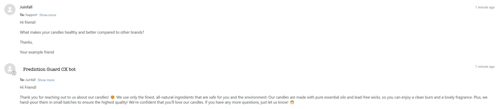

# Respond to customer queries

## Introduction

The CX Responder is a powerful tool developed by Prediction Guard for automating customer responses using language models. This tool integrates various components, including LanceDB for database setup, RAG (Retrieval Augmented Generation) technique for enhancing the accuracy and reliability of generative AI models with facts fetched from external sources, and additional features for sentiment analysis.

# LanceDB Vector Database Setup
LanceDB is an open-source database for vector-search built with persistent storage, which greatly simplifies retrieval, filtering and management of embeddings.
More about it here : [Lancedb docs](./https://lancedb.github.io/lancedb/)

## Connect lanceDB
Define the local path and connect to the LanceDB:

```python
# Local path of the vector db
uri = ".lancedb"
db = lancedb.connect(uri)
```

## Embeddings Setup
Specify the embeddings setup using the Sentence Transformer model:

```python
# Embeddings setup
name = "all-MiniLM-L12-v2"
```

## Load Model
Load the Sentence Transformer model for embedding:

```python
def load_model():
    return SentenceTransformer(name)
```
## Embedding Function
Define the function to embed queries using the loaded model:

```python
def embed(query, embModel):
    return embModel.encode(query)
```

## Load Data
The load_data function is responsible for creating the LanceDB vector database:

```python
def load_data():

    # If the LanceDB directory exists, remove it
    if os.path.exists(".lancedb"):
        shutil.rmtree(".lancedb")
    
    # Create a new LanceDB connection
    os.mkdir(".lancedb")
    db = lancedb.connect(uri)

    # Load the Sentence Transformer model for batch embedding
    batchModel = SentenceTransformer(name)

    def batch_embed_func(batch):
       return [batchModel.encode(sentence) for sentence in batch]

    # Embed the data and create a vector database
    vecData = with_embeddings(batch_embed_func, promos)

    if "table-name" not in db.table_names():
        db.create_table("table-name", data=vecData)
    else:
        table = db.open_table("table-name")
        table.add(data=vecData)

    return
```
## Usage in Main Code
In our use case, we zipped the 2 vector databases in an AWS S3 bucket. Ensure that the necessary steps are taken to upload the LanceDB vector databases to your AWS S3 bucket and access them in your main code.

## LLM prompt templates
Leveraging Prediction Guard provides seamless access to cutting-edge open and closed access Language Models (LLMs). Our chosen model, "Nous-Hermes-Llama2-13B," plays a pivotal role in powering this CX responder. Combined with thoughtfully crafted prompt engineering templates, we efficiently summarize customer queries and generate responses using context from the vector databases containing website policies and macros information. The culmination involves infusing our company's distinctive brand voice to produce concise and engaging responses.

## LLM Prompt Templates

### Summarize Template
This demonstration is for an e-commerce industry use case , modify the prompt instruction accordingly for your own use cases.

```python
summarize_template = """### Instruction: 
Summarize the below conversation between customer and "company-name" agent in approximately 100 words. If specific products, order numbers or other order specific information is mentioned, include that information in the summary.

### Input:
{conversation}

### Response:

"""
summarize_prompt = PromptTemplate(
    input_variables=["conversation"],
    template=summarize_template,
)
```

### Policy/Macros info template
In this below template, summary refers to the mail conversation summary generated using the summary template, question refers to the input customer query and context refers to the vector DB containing the policy/macro information.

```python
policy_template = """### Instruction:
Read the below summary of a previous conversation between a customer and the "company-name" agent. Respond to the customer message included in the below input based on the policy provided in the below input. You can't perform any action outside of a positive general response. Don't add any additional action information like order details, phone numbers, links etc. 


### Input:
Conversation summary:  {summary}

Customer message: {question}

Policy information: {context}

### Response:
"""
policy_prompt = PromptTemplate(
    input_variables=["summary", "context", "question"],
    template=policy_template,
)

```
### Brand Voice Template
This template takes in the output generated by above llm calls to add some emojis,empathy and excitement to the responses and rephrase it according to the company brand voice. Here you can also use few shot prompting techniques to pass some examples into the prompt.

```python
brand_template = """### Instruction:
Read the input - which is a draft response to a customer query. Rephrase it by adding an emoji, empathy and a little excitement. Remove any email sign-offs or email signatures at the end of the draft response. Do not use more than two emojis. Return the response in a email response format like the following:

Hi Friend! 

Thank you for reaching out....

### Input:
{sentence}

### Response:
"""
voice_prompt = PromptTemplate(
    input_variables=["sentence"],
    template=brand_template,
)
```
These LLM templates provide a structured framework for generating customer responses with a consistent and positive brand voice. Adjust the templates as needed to match the specific requirements of your customer response tool.

## API Route: Generate Response
The generate_response function is a crucial component of the CX responder API route. Let's break down its logic:

### Summarization
The function begins by checking if there is any prior conversation (mailchain). If none exists, it sets the summary to "No prior conversation found." Otherwise, it utilizes the "Nous-Hermes-Llama2-13B" model to generate a summary of the conversation.

```python
###Summarize
if mailchain=="":
    summary="No prior conversation found"
else:
    result = pg.Completion.create(
        model="Nous-Hermes-Llama2-13B",
        prompt=summarize_prompt.format(conversation=mailchain),
        temperature=0.1,
        max_tokens=200
    )

    summary=result['choices'][0]['text']
print("Summary: " +summary)
```

### Vector Database Search
Next, the function searches the "table-1-name" table of the vector database for relevant website policies information. It uses the Sentence Transformer model to embed the customer's statement (statement). If no relevant results are found within a certain similarity threshold, the search is extended to the "table-2-name" table, which holds information related to macros.

```python
# Get the context from the vector DB
table = db.open_table("cx1")
results = table.search(embed(statement, model)).limit(2).to_df()
results = results[results['_distance'] < 0.8]

if len(results) == 0:

    # If no output from policy model use macros model
    table = db.open_table("cx2")
    results = table.search(embed(statement, model)).limit(2).to_df()
    results = results[results['_distance'] < 0.8]
 ```  

### General Response
If there are no results from the policy or macros model, the function resorts to a general response. It fills the general prompt template (prompt_filled) with the obtained summary and customer's question and generates a response using the "Nous-Hermes-Llama2-13B" model. The response undergoes further refinement with the brand voice template.

```python
if len(results) == 0:

    #if no output from macros model use general response
    prompt_filled = general_prompt.format(summary=summary,question=statement)
    output = pg.Completion.create(
        model="Nous-Hermes-Llama2-13B",
        prompt=prompt_filled,
        max_tokens=300,
        temperature=0.1,
        top_p=1,
        )
    completion = output['choices'][0]['text']

    # Brand voice
    prompt_filled = voice_prompt.format(sentence=completion)
    output = pg.Completion.create(
        model="Nous-Hermes-Llama2-13B",
        prompt=prompt_filled,
        max_tokens=300,
        temperature=0.1,
        top_p=1,
    )
    completion = output['choices'][0]['text']
    print("general")
    return {"response": completion}
 ```  

### Macros and Policy Response
If the macros model provides relevant information, it selects the appropriate document (doc_use) and fills the macros response prompt, generating a response as described below. Similar code for the policy response..

Here the results are sorted by the distances.
"mail" column refers to the text within the macros.

```python
# Check the returned results
results.sort_values(by=['_distance'], inplace=True, ascending=True)

doc_use = ""
for _, row in results.iterrows():
    if len(row['mail'].split(' ')) < 10:
        continue
    else:
        doc_use = row['mail']
        break

# Handle no relevant docs
if doc_use == "":
    completion = "Sorry, I can't find relevant resource to answer that question. Could you please rephrase your question."
    return {"response": completion}
else:
    prompt_filled = macros_prompt.format(summary=summary,context=doc_use,question=statement,)

    # Respond to the user
    output = pg.Completion.create(
        model="Nous-Hermes-Llama2-13B",
        prompt=prompt_filled,
        max_tokens=300,
        temperature=0.1
        )
    completion = output['choices'][0]['text']

    # Brand voice
    prompt_filled = voice_prompt.format(sentence=completion)
    output = pg.Completion.create(
        model="Nous-Hermes-Llama2-13B",
        prompt=prompt_filled,
        max_tokens=300,
        temperature=0.1,
        top_p=1,
        )
    completion = output['choices'][0]['text']
    print("macros")
    return {"response": completion}
        
```
### Brand Voice and Finalization
In both cases, the generated responses undergo a final refinement, adding a touch of the company's brand voice. The resulting completion is returned as the API response.

The logic ensures that the CX responder provides accurate, context-aware, and brand-consistent responses to customer queries based on the available information in the vector databases.

## Deploy a FAST API application
This section defines the FastAPI routes and the main execution for the CX responder API.

### Default Route ("/")
The default route, accessed through an HTTP GET request, returns a simple JSON response: {"Hello": "World"}. This is a placeholder or a basic health check for the API.

### RespondRequest Class
A Pydantic BaseModel class, RespondRequest, is defined to handle the request payload for the /predict endpoint. It includes two fields: mailchain (representing prior conversation history) and prompt (representing the customer's query).

### Predict Endpoint ("/predict")
This endpoint is configured to handle HTTP POST requests. It utilizes the RespondRequest model to parse the incoming request. The following steps are performed:

### Sentiment Analysis: 
The sentiment score of the customer's query is calculated using the get_sentiment_score function.

### Response Generation: 
The generate_response function is invoked with the mailchain and prompt from the request payload. The resulting response and its completion are stored.

### API Response: 
The API responds with a JSON object containing the generated response, an indication of whether an action is required based on the flag, and a frustration flag based on the sentiment score.The script checks if it is the main module and, if so, runs the FastAPI application using the Uvicorn server. The server is configured to run on host "0.0.0.0" and port 8000.

This configuration sets up a simple yet effective API structure for the CX responder, allowing it to receive queries, generate responses, and provide actionable insights based on sentiment and flagging.

```python
#-----------------#
# API            #
#-----------------#

@app.get("/")
def read_root():
    return {"Hello": "World"}

class RespondRequest(BaseModel):
    mailchain: str
    prompt: str

@app.post("/predict")
def update_item(req: RespondRequest):
    ###Sentiment
    score = get_sentiment_score(req.prompt)
    print("Sentiment score: ",score)
    response=generate_response(
        req.mailchain,
        req.prompt
    )
    completion=response.get("response")
    return {"response":response,
        "frustrated":False if score > -0 else True,
        }

#-----------------#
# Main            #
#-----------------#

if __name__ == "__main__":
    import uvicorn
    uvicorn.run(app, port=8000, host="0.0.0.0")
```
### `/predict`

Consider a scenario where you want to use the CX Responder API to generate responses based on customer queries. Here's a demonstration of how the /predict endpoint can be utilized:

#### Request

- **Method:** POST
- **Path:** `/predict`

##### Request Body

```json
{
  "mailchain": "",
  "prompt": "when will my order get shipped?",
}
```
##### Response
```json
{
    "response": {
        "response": " Hi there! 😊 I'm sorry to hear that you haven't received your order yet. Please provide me with your order number and I'll look into it right away. 📦🔍"
    },
    "frustrated": false
}
```

# A demo of our CX responder in action


# GitHub Repository Link
[Link to GitHub Repo](./https://github.com/predictionguard/acc-cx)