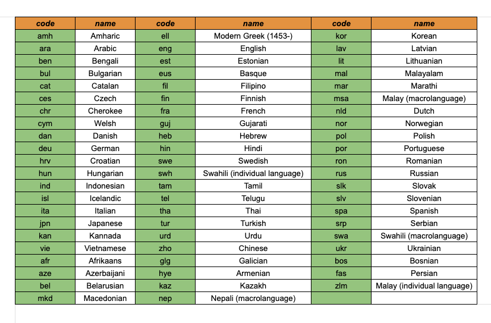

# Translate

You can get machine translation and translation quality scores from the `/translate` endpoint. This endpoint/class takes three parameters:

- `text` - The text to translate.
- `source_lang` - The ISO 639 source language code (e.g. 'eng' for English).
- `target_lang` - The ISO 639 target language code (e.g 'fra' for French).

Under the hood, the `/translate` endpoint leverages state-of-the-art machine translation models including Nous-hermes-llama2-13b, OpenAI, DeepL, and Google Translate to perform translations. The translations from these different models are scored and ranked using Unbabel's advanced COMET scoring system. This allows us to select the highest quality machine translation for the given source and target languages.

## Supported Languages

Our translation API supports a wide range of languages, including but not limited to English,Hindi, French, Spanish, German, and more. Refer to the language codes to identify specific languages.



### `/translate`

The /translate endpoint will return a JSON object with two fields:

- `translation` - The translated text.
- `score` - A score from -1.0 to 1.0 representing the translation quality. Higher the score better the quality.


## Generate a translation

import { Tab, Tabs } from 'nextra-theme-docs'

<Tabs items={['Python', 'cURL']}  defaultIndex="0">
  <Tab>
    ```python filename="main.py" copy
    import os
    import json

    import predictionguard as pg

    # Set your PREDICTIONGUARD access token as an environmental variable.
    os.environ["PREDICTIONGUARD_TOKEN"] = "<your access token>"

    # Translate the text.
    result = pg.Translate.create(
        		text="The sky is blue",
                source_lang="eng",
                target_lang="fra"
        )

    print(json.dumps(
        result,
        sort_keys=True,
        indent=4,
        separators=(',', ': ')
    ))
    ```
  </Tab>
  <Tab>
    ```bash copy
    $ curl --location --request POST 'https://api.predictionguard.com/translate' \
    --header 'x-api-key: <your access token>' \
    --header 'Content-Type: application/json' \
    --data-raw '{
        text="The sky is blue",
        source_lang="eng",
        target_lang="fra"
    }'
    ```
  </Tab>
</Tabs>

The output will look something like:

```
{"response":{"Best translation":"Le ciel est bleu","Score":0.8694158792495728}}
```
