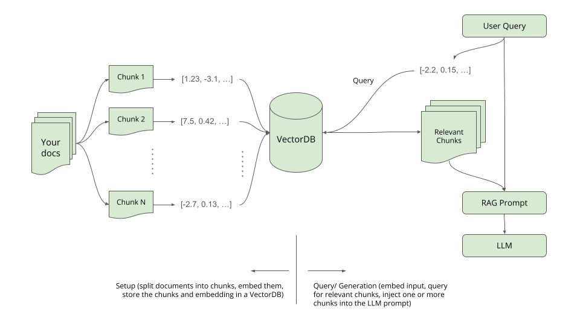

# Chaining and Retrieval

(Run this example in Google Colab [here](https://drive.google.com/file/d/1ukAPgQf39POwHhirIknTwKN7A9NLlFyt/view?usp=sharing))

We've actually already seen how it can be useful to "chain" various LLM operations together (see other notebooks under [Using LLMs](../usingllms)). In the [Hinglish chat example](prompting) we chained a response generation and then a machine translation using LLMs.

**As you solve problems with LLMs, do NOT always think about your task as a single prompt.** Decompose your problem into multiple steps. Just like programming which uses multiple functions, classes, etc. LLM integration is a new kind of reasoning engine that you can "program" in a multi-step, conditional, control flow sort of fashion.

Further, enterprise LLM appllications need reliability, trust, and consistency. **Because LLMs only predict probable text, they have no understanding or connection to reality.** This produces **hallucinations** that can be part of a coherent text block but factually (or otherwise) wrong. To deal with this we need to **ground** on LLM operations with external data.

## Dependencies and imports

We will use LangChain, LanceDB, and a few other things in this tutorial.

```bash copy
$ pip install langchain predictionguard lancedb html2text sentence-transformers
```

```python copy
import os
import urllib.request

import html2text
import predictionguard as pg
from langchain import PromptTemplate, FewShotPromptTemplate
from langchain.text_splitter import CharacterTextSplitter
from sentence_transformers import SentenceTransformer
import numpy as np
from getpass import getpass
import lancedb
from lancedb.embeddings import with_embeddings
import pandas as pd

pg_access_token = getpass('Enter your Prediction Guard access token: ')
os.environ['PREDICTIONGUARD_TOKEN'] = pg_access_token
```

## Chaining

Le'ts say that we are trying to create a response to a user and we want our LLM to follow a variety of rules. We could try to encode all of these instructions into a single prompt. However, as we accumulate more and more instructions the prompt becomes harder and harder for the LLM to follow. Think about an LLM like a child or a high school intern. We want to make things as clear and easy as possible, and complicated instructions don't do that.

```python copy
template = """### Instruction:
Decide if the following input message is an informational question, a general chat message, or a request for code generation.
If the message is an informational question, answer it based on the informational context provided below.
If the message is a general chat message, respond in a kind and friendly manner based on the coversation context provided below.
If the message is a request for code generation, respond with a code snippet.

### Input:
Message: {query}

Informational Context: The Greater Los Angeles and San Francisco Bay areas in California are the nation's second and fifth-most populous urban regions, respectively. Greater Los Angeles has over 18.7 million residents and the San Francisco Bay Area has over 9.6 million residents. Los Angeles is state's most populous city and the nation's second-most populous city. San Francisco is the second-most densely populated major city in the country. Los Angeles County is the country's most populous county, and San Bernardino County is the nation's largest county by area. Sacramento is the state's capital.

Conversational Context:
Human - "Hello, how are you?"
AI - "I'm good, what can I help you with?"
Human - "What is the captital of California?"
AI - "Sacramento"
Human - "Thanks!"
AI - "You are welcome!"

### Response:
"""

prompt = PromptTemplate(
    input_variables=["query"],
    template=template,
)

result = pg.Completion.create(
    model="Nous-Hermes-Llama2-13B",
    prompt=prompt.format(query="What is the population of LA?")
)

print(result['choices'][0]['text'])
```

When we run this, at least sometimes, we get bad output because of the complicated instructions:

```
The population of LA is approximately 3.9 million people. 
```

Rather than try to handle everything in one call to the LLM, let's decompose our logic into multiple calls that are each simple. We will also add in some non-LLM logic The chain of processing is:
- Prompt 1 - Determine if the message is a request for code generation.
- Prompt 2 - Q&A prompt to answer based on informational context
- Prompt 3 - A general chat template for when there isn't an informational question being asked
- Prompt 4 - A code generation prompt
- Question detector - A non-LLM based detection of whether an input in a question or not

```python code
category_template = """### Instruction:
Read the below input and determine if it is a request to generate computer code? Respond "yes" or "no" and no other text.

### Input:
{query}

### Response:
"""

category_prompt = PromptTemplate(
    input_variables=["query"],
    template=category_template
)

qa_template = """### Instruction:
Read the context below and respond with an answer to the question. If the question cannot be answered based on the context alone or the context does not explicitly say the answer to the question, write "Sorry I had trouble answering this question, based on the information I found."

### Input:
Context: {context}

Question: {query}

### Response:
"""

qa_prompt = PromptTemplate(
    input_variables=["context", "query"],
    template=qa_template
)

chat_template = """### Instruction:
You are a friendly and clever AI assistant. Respond to the latest human message in the input conversation below.

### Input:
{context}
Human: {query}
AI:

### Response:
"""

chat_prompt = PromptTemplate(
    input_variables=["context", "query"],
    template=chat_template
)

code_template = """### Instruction:
You are a code generation assistant. Respond with a code snippet and any explanation requested in the below input.

### Input:
{query}

### Response:
"""

code_prompt = PromptTemplate(
    input_variables=["query"],
    template=code_template
)


# QuestionID provides some help in determining if a sentence is a question.
class QuestionID:
    """
        QuestionID has the actual logic used to determine if sentence is a question
    """
    def padCharacter(self, character: str, sentence: str):
        if character in sentence:
            position = sentence.index(character)
            if position > 0 and position < len(sentence):

                # Check for existing white space before the special character.
                if (sentence[position - 1]) != " ":
                    sentence = sentence.replace(character, (" " + character))

        return sentence

    def predict(self, sentence: str):
        questionStarters = [
            "which", "wont", "cant", "isnt", "arent", "is", "do", "does",
            "will", "can"
        ]
        questionElements = [
            "who", "what", "when", "where", "why", "how", "sup", "?"
        ]

        sentence = sentence.lower()
        sentence = sentence.replace("\'", "")
        sentence = self.padCharacter('?', sentence)
        splitWords = sentence.split()

        if any(word == splitWords[0] for word in questionStarters) or any(
                word in splitWords for word in questionElements):
            return True
        else:
            return False

def response_chain(message, convo_context, info_context):

  # Determine what kind of message this is.
  result = pg.Completion.create(
      model="WizardCoder",
      prompt=category_prompt.format(query=message)
  )

  # configure our chain
  if "yes" in result['choices'][0]['text']:
    code = "yes"
  else:
    code = "no"
  qIDModel = QuestionID()
  question = qIDModel.predict(message)

  if code == "no" and question:

    # Handle the informational request.
    result = pg.Completion.create(
        model="Nous-Hermes-Llama2-13B",
        prompt=qa_prompt.format(context=info_context, query=message)
    )
    completion = result['choices'][0]['text'].split('#')[0].strip()

  elif code == "yes":

    # Handle the code generation request.
    result = pg.Completion.create(
        model="WizardCoder",
        prompt=code_prompt.format(query=message),
        max_tokens=500
    )
    completion = result['choices'][0]['text']

  else:

    # Handle the chat message.
    result = pg.Completion.create(
        model="Nous-Hermes-Llama2-13B",
        prompt=chat_prompt.format(context=convo_context, query=message),
        output={
            "toxicity": True
        }
    )
    completion = result['choices'][0]['text'].split('Human:')[0].strip()

  return code, question, completion
```

Now we can supply the relevant context and options to our response chain and see what we get back:

```python copy
info_context = "The Greater Los Angeles and San Francisco Bay areas in California are the nation's second and fifth-most populous urban regions, respectively. Greater Los Angeles has over 18.7 million residents and the San Francisco Bay Area has over 9.6 million residents. Los Angeles is state's most populous city and the nation's second-most populous city. San Francisco is the second-most densely populated major city in the country. Los Angeles County is the country's most populous county, and San Bernardino County is the nation's largest county by area. Sacramento is the state's capital."

convo_context = """Human: Hello, how are you?
AI: I'm good, what can I help you with?
Human: What is the captital of California?
AI: Sacramento
Human: Thanks!
AI: You are welcome!"""

message = "Which city in California has the highest population?"
#message = "I'm really enjoying this conversation."
#message = "Generate some python code that gets the current weather in the bay area."

code, question, completion = response_chain(message, convo_context, info_context)
print("CODE GEN REQUESTED:", code)
print("QUESTION:", question)
print("")
print("RESPONSE:", completion)
```

This should respond with something similar to:

```
CODE GEN REQUESTED: no
QUESTION: True

RESPONSE: Los Angeles is the city in California with the highest population.
```

## External knowledge in prompts, Grounding

We've actually already seen external knowledge within our prompts. In the [question and answer example](prompting), the `context` that we pasted in was a copy of phrasing on the Domino's website. This "grounds" the prompt with external knowledge that is current and factual.

```python copy
template = """### Instruction:
Read the context below and respond with an answer to the question. If the question cannot be answered based on the context alone or the context does not explicitly say the answer to the question, write "Sorry I had trouble answering this question, based on the information I found."

### Input:
Context: {context}

Question: {question}

### Response:
"""

prompt = PromptTemplate(
    input_variables=["context", "question"],
    template=template,
)

context = "Domino's gift cards are great for any person and any occasion. There are a number of different options to choose from. Each comes with a personalized card carrier and is delivered via US Mail."

question = "How are gift cards delivered?"

myprompt = prompt.format(context=context, question=question)

result = pg.Completion.create(
    model="Nous-Hermes-Llama2-13B",
    prompt=myprompt
)
result['choices'][0]['text'].split('#')[0].strip()
```

The answer returned from this prompting is grounded in the external knowledge we inserted, so we aren't relying on the LLM to provide the answer with its own probabilities and based on its training data.

```
Gift cards are delivered via US Mail.
```

## Retrieval augmentated generation (RAG)



Retrieval-augmented generation (RAG) is an innovative approach that merges the capabilities of large-scale retrieval systems with sequence-to-sequence models to enhance their performance in generating detailed and contextually relevant responses. Instead of relying solely on the knowledge contained within the model's parameters, RAG allows the model to dynamically retrieve and integrate information from an external database or a set of documents during the generation process. By doing so, it provides a bridge between the vast knowledge stored in external sources and the powerful generation abilities of neural models, enabling more informed, diverse, and context-aware outputs in tasks like question answering, dialogue systems, and more.

```python copy
# Let's get the html off of a website.
fp = urllib.request.urlopen("https://docs.kernel.org/process/submitting-patches.html")
mybytes = fp.read()
html = mybytes.decode("utf8")
fp.close()

# And convert it to text.
h = html2text.HTML2Text()
h.ignore_links = True
text = h.handle(html)

print(text)
```

This is the text that we will be referencing in our RAG system. I mean, who doesn't want to know more about the linux kernel. The above code should print out something like the following, which is the text on that website:

```
# The Linux Kernel

6.7.0-rc4

### Quick search

### Contents

  * A guide to the Kernel Development Process
  * Submitting patches: the essential guide to getting your code into the kernel
    * Obtain a current source tree
    * Describe your changes
    * Separate your changes
    * Style-check your changes
    * Select the recipients for 

etc...
```

Let's clean things up a bit and split it into smaller chunks (that will fit into our LLM prompts):

```python copy
# Clean things up just a bit.
text = text.split("### This Page")[1]
text = text.split("## References")[0]

# Chunk the text into smaller pieces for injection into LLM prompts.
text_splitter = CharacterTextSplitter(chunk_size=700, chunk_overlap=50)
docs = text_splitter.split_text(text)

# Let's checkout some of the chunks!
for i in range(0, 3):
  print("Chunk", str(i+1))
  print("----------------------------")
  print(docs[i])
  print("")
```

Our reference "chunks" for retrieval look like the following:

```
Chunk 1
----------------------------
* Show Source

# Submitting patches: the essential guide to getting your code into the
kernel¶

For a person or company who wishes to submit a change to the Linux kernel, the
process can sometimes be daunting if you're not familiar with "the system."
This text is a collection of suggestions which can greatly increase the
chances of your change being accepted.

Chunk 2
----------------------------
This document contains a large number of suggestions in a relatively terse
format. For detailed information on how the kernel development process works,
see A guide to the Kernel Development Process. Also, read Linux Kernel patch
submission checklist for a list of items to check before submitting code. For
device tree binding patches, read Submitting Devicetree (DT) binding patches.

This documentation assumes that you're using `git` to prepare your patches. If
you're unfamiliar with `git`, you would be well-advised to learn how to use
it, it will make your life as a kernel developer and in general much easier.

Chunk 3
----------------------------
Some subsystems and maintainer trees have additional information about their
workflow and expectations, see Documentation/process/maintainer-handbooks.rst.

## Obtain a current source tree¶

If you do not have a repository with the current kernel source handy, use
`git` to obtain one. You'll want to start with the mainline repository, which
can be grabbed with:

    
    
    git clone git://git.kernel.org/pub/scm/linux/kernel/git/torvalds/linux.git
```

We will now do a bit more clean up and "embed" these chunks to store them in a Vector Database. 

```python copy
# Let's take care of some of the formatting so it doesn't conflict with our
# typical prompt template structure
docs = [x.replace('#', '-') for x in docs]


# Now we need to embed these documents and put them into a "vector store" or
# "vector db" that we will use for semantic search and retrieval.

# Embeddings setup
name="all-MiniLM-L12-v2"
model = SentenceTransformer(name)

def embed_batch(batch):
    return [model.encode(sentence) for sentence in batch]

def embed(sentence):
    return model.encode(sentence)

# LanceDB setup
os.mkdir(".lancedb")
uri = ".lancedb"
db = lancedb.connect(uri)

# Create a dataframe with the chunk ids and chunks
metadata = []
for i in range(len(docs)):
    metadata.append([
        i,
        docs[i]
    ])
doc_df = pd.DataFrame(metadata, columns=["chunk", "text"])

# Embed the documents
data = with_embeddings(embed_batch, doc_df)

# Create the DB table and add the records.
db.create_table("linux", data=data)
table = db.open_table("linux")
table.add(data=data)
```

We now have:
- Downloaded our reference data (for eventual retrieval)
- Split that reference data into relevant sized chunks for injection into our prompts
- Embedded those chunks (such that we have a vector that can be used for matching)
- Stored the vectors into the Vector Database (LanceDB in this case)

We can now try matching to text chunks in the database:

```python copy
# Let's try to match a query to one of our documents.
message = "How many problems should be solved per patch?"
results = table.search(embed(message)).limit(5).to_df()
results.head()
```

This will give a dataframe with a ranking of relevant text chunks by a "distance" metric. The lower the distance, the more semantically relevant the chunk is to the user query.

|    |   chunk |   _distance |
|---:|--------:|------------:|
|  0 |      52 |    0.785209 |
|  1 |      52 |    0.785209 |
|  2 |      14 |    0.844908 |
|  3 |      14 |    0.844908 |
|  4 |       6 |    0.878058 |

Now we can create a function that will return an answer to a user query based on the RAG methodology:

```python copy
# Now let's augment our Q&A prompt with this external knowledge on-the-fly!!!
template = """### Instruction:
Read the below input context and respond with a short answer to the given question. Use only the information in the below input to answer the question. If you cannot answer the question, respond with "Sorry, I can't find an answer, but you might try looking in the following resource."

### Input:
Context: {context}

Question: {question}

### Response:
"""
qa_prompt = PromptTemplate(
    input_variables=["context", "question"],
    template=template,
)

def rag_answer(message):

  # Search the for relevant context
  results = table.search(embed(message)).limit(5).to_df()
  results.sort_values(by=['_distance'], inplace=True, ascending=True)
  doc_use = results['text'].values[0]

  # Augment the prompt with the context
  prompt = qa_prompt.format(context=doc_use, question=message)

  # Get a response
  result = pg.Completion.create(
      model="Nous-Hermes-Llama2-13B",
      prompt=prompt
  )

  return result['choices'][0]['text']
```

This will return something similar to:

```
RESPONSE: A single patch should solve one problem at a time. 
```